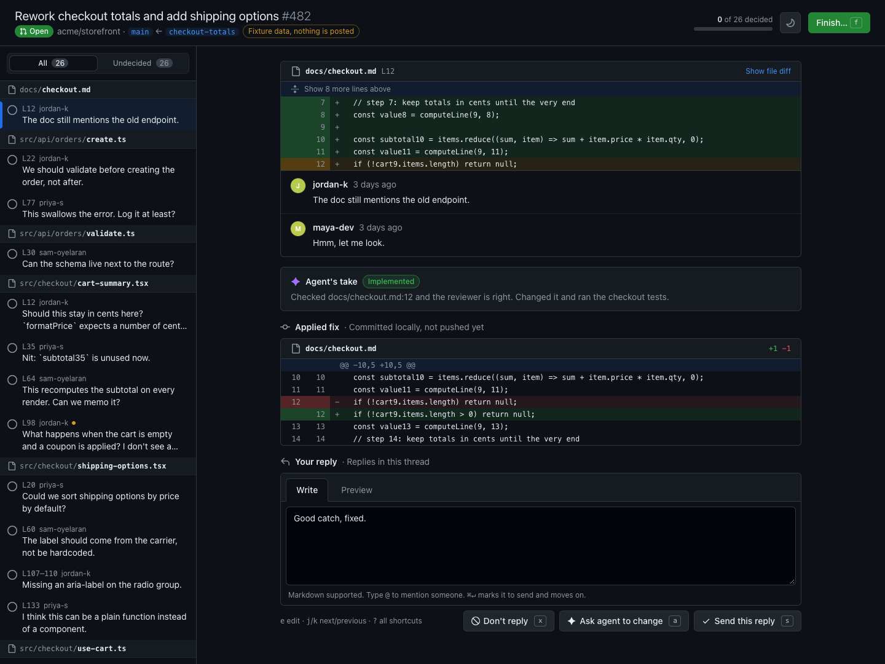
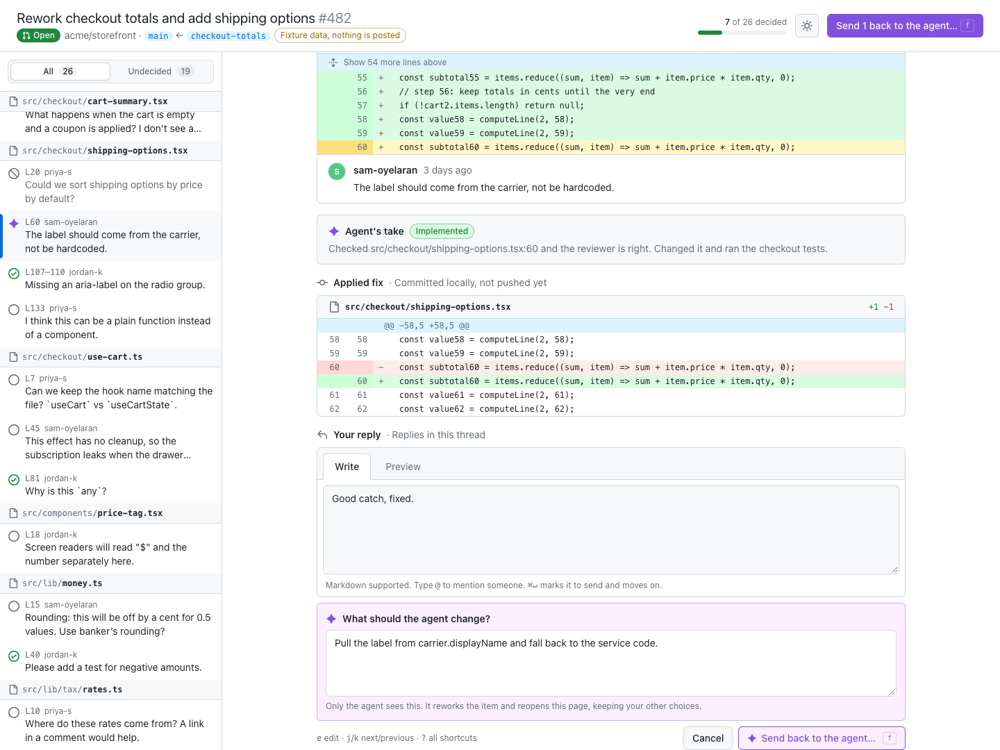
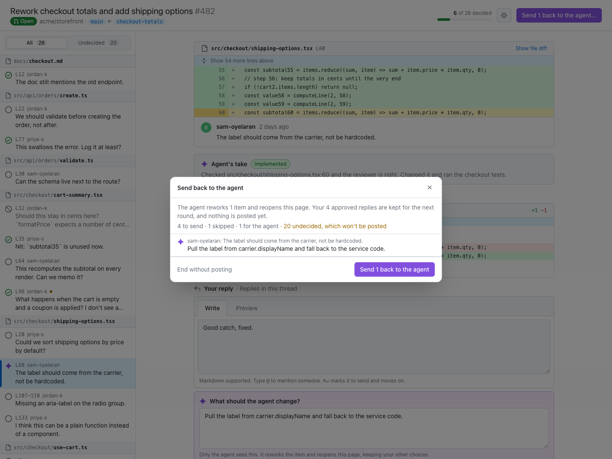

# address-pr-review

An agent skill for working through a pull request's review feedback, where you stay in charge of every word that reaches your colleagues.

The agent reads every unresolved review thread and PR comment, makes the fixes it judges right as local commits, and drafts a reply to each. Then it opens a local app that looks like the PR's "Files changed" tab: each comment on its diff, the fix the agent applied, why it did it, and its draft reply. For each item you send the reply (edited however you like), skip it, or ask the agent to change something. Items you send back get reworked and the app reopens with your other choices kept. When you approve, the agent pushes the fixes and then posts exactly the replies you approved.



- Keyboard-first for big PRs: `j`/`k` to move, `s` send, `x` skip, `a` ask the agent, `e` edit, `⌘↵` send and move on.
- A general comment on the PR, alongside the thread replies.
- `@` autocomplete from the PR's participants, then the repo's mentionable users.
- Preview rendered by GitHub's own markdown API.
- GitHub's light and dark themes, following your OS.
- Edits autosave, and a failed post can be retried without double posting.

## Install

```sh
npx skills add srtfisher/address-pr-review
```

That installs the skill into `~/.agents/skills/` and links it for the agents you pick (Claude Code, Codex, Cursor, and others). The app ships prebuilt inside the skill, so there's nothing to compile. You need Node 20+ and the [GitHub CLI](https://cli.github.com/) logged in.

Then, on a branch with an open PR, ask your agent to use `/address-pr-review`, or just ask in plain words:

```text
> Work through the review feedback on this PR.
> Address the comments on #482.
> /address-pr-review https://github.com/acme/storefront/pull/482
```

## A review round

1. The agent reads the open feedback, commits the fixes it agrees with, and opens the app. Each item shows the comment in its diff, the agent's take (implemented, declined, acknowledged, or needs clarification), the fix it committed, and the draft reply.
2. You go through the list. Send the reply as written or after editing it, skip it, or tell the agent what to change instead. Only the agent sees that note.

   

3. Finish the round. If anything is going back to the agent, it reworks just those items and reopens the app with your other choices kept. Nothing is posted until a round ends with no items sent back.

   

4. Once you approve, the agent pushes the fixes and posts your replies.

## How it works

The skill drives a small CLI at `skills/address-pr-review/app/cli.mjs`. It's also published to npm, so you can run it without the skill, e.g. `npx @srtfisher/address-pr-review feedback --pr 482`:

- `feedback` prints the PR's open feedback as JSON for the agent.
- `open <drafts.json>` starts the local app on `127.0.0.1` with a random port and session token, and opens your browser. `--session <dir>` reopens an earlier session for the next round, keeping your choices.
- `wait <session>` blocks until you finish a round (exit 3 means still waiting, so agents with tool timeouts can poll). The round ends `approved`, `revise`, or `canceled`.
- `post <session>` posts the replies you approved, byte for byte from the app's saved state. The agent runs it only after pushing the fixes.

Inline threads get in-thread replies. Top-level comments, review bodies, and the general comment post as new PR comments, since GitHub can't thread those.

## Development

```sh
npm install
npm test
npm run dev    # build, then open the app on the synthetic fixture (posts nothing)
```

`npm run build` writes the UI and the bundled CLI into `skills/address-pr-review/app/`, which is committed so installs work without a build. CI fails if it's out of date. The fixture is generated by `node test/fixtures/generate.ts`, and the screenshots above are taken from it.

To release, bump `version` in `package.json`, commit, and push a matching tag (`git tag v0.2.0 && git push origin v0.2.0`). The release workflow runs the checks, publishes to npm through trusted publishing, and creates the GitHub release.
